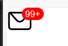
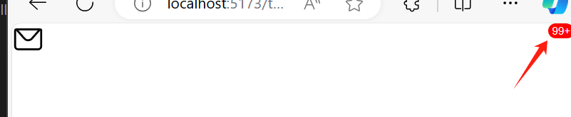
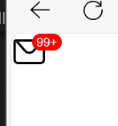

---
category:
  - 消息角标
tag:
  - 图标
  - 父相子绝
  - 胶囊角标
date: 2024-03-02
sidebar: true
timeline: true
---
# 实现消息99+角标



## 使用element-plus图标

由于`message-wrapper`是div元素（默认盒子模型是`block`）会占满整行，将`message-wrapper`的盒子模型设置为`inline-block`，这样就可以让`message-wrapper`的宽度和图标`message`的宽度一样。


可以看到`message-wrapper`的宽度和浏览器的宽度一样。


设置了`inline-block`后，`message-wrapper`的宽度和图标`message`的宽度一样。

```vue
<template>
  <div class="message-wrapper">
    <el-icon size="30">
      <Message></Message>
    </el-icon>
  </div>
</template>
<script setup>
import { Message } from '@element-plus/icons-vue'
</script>

<style lang="scss" scoped>
.message-wrapper {
  display: inline-block;
}
</style>
```

## 父相子绝

由于数字99+要固定在父亲元素的右上角，所以这种情况需要让父亲是相对布局，子元素是绝对布局。然后让子元素的top和right为0，这样就实现了固定在右上角的效果。

如果不设置父亲元素的相对布局，子元素的top和right为0，那么子元素就会在窗口的右上角，而不是在父元素的右上角。



此时消息99+会出现在窗口的右上角。



此时消息99+会出现在父元素的右上角。

```vue
<template>
  <div class="message">
    <el-icon size="30">
      <Message></Message>
    </el-icon>
    <div class="num">99+</div>
  </div>
</template>

<script setup>
import { Message } from '@element-plus/icons-vue'
</script>

<style lang="scss" scoped>
.message-wrapper {
  position: relative;
  display: inline-block;
  .num {
    top: 0;
    right: -12px;
    position: absolute;
  }
}
</style>

```

## 数字提示样式

### 文字垂直具中

需要注意的是此处设置了`num`的`height: 14px;` 为了让文字在垂直方向上具中，需要同时设置`line-height: 14px;`。


可以看加此时文字没有在垂直方向上没局中。


`height: 30px;`同时设置`line-height: 30px;`后，文字在垂直方向上居中。

### 圆角

文字本来就在垂直方向上具中那为什么要大费周折的设置`height`和`line-height`呢？因为圆角需要。

为了让数字的红色背景呈现胶囊形状，即`border-radius: ?px;`其中的`?`要等于高度的一半。

最后再加一点点左右的`padding: 0 4px;`就呈现胶囊形状了。

```vue
<template>
  <div class="message">
    <el-icon size="30">
      <Message></Message>
    </el-icon>
    <div class="num">99+</div>
  </div>
</template>

<script setup>
import { Message } from '@element-plus/icons-vue'
</script>

<style lang="scss" scoped>
.message-wrapper {
  position: relative;
  display: inline-block;
  .num {
    top: 0;
    right: -12px;
    position: absolute;
    background-color: red;
    font-size: 10px;
    height: 14px;
    line-height: 14px;
    border-radius: 7px;
    color: white;
    padding: 0 4px;
  }
}
</style>

```
