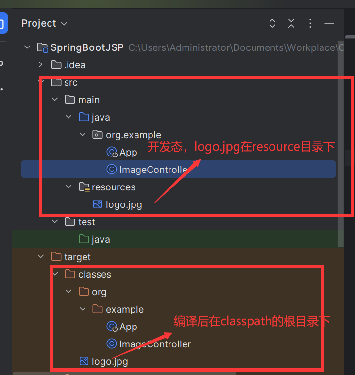

---
category:
  - IO
tag:
  - SpringBoot
  - 图片二进制流
date: 2024-02-29
timeline: true
---
# 前端显示二进制流图片

## 读取resource目录下的图片

在resource目录下的文件（文件夹）编译后都会在classpath的根目录下下。如下图：


从类路径中读取名为"logo.jpg"的文件内容，并将其转换为字节数组。

1. `ClassPathResource("logo.jpg")`：这是创建一个Spring Framework中的`ClassPathResource`对象，它代表了一个应从类路径获取的资源。

2. `.getInputStream()`：调用该方法会返回一个指向该资源的输入流（InputStream），通过这个输入流可以读取“logo.jpg”文件的实际内容。

3. `.readAllBytes()`：进一步调用此方法会读取并返回输入流中的所有字节，即将“logo.jpg”图片文件的内容以字节数组的形式一次性读取出来。

```java
  @GetMapping("logo")
  @CrossOrigin
  public byte[] getLogo() throws IOException {
    return new ClassPathResource("logo.jpg").getInputStream().readAllBytes();
  }
```

:::tip
`ClassPathResource`是Spring框架中`org.springframework.core.io`包下的一个类，它主要用于表示类路径（classpath）中的资源。当你需要从项目的类路径下加载配置文件、静态资源等时，可以使用这个类。

函数还使用了`@CrossOrigin`注解来允许跨域请求。
:::

:::info
如果你像读取系统上的文件，可以使用`FileSystemResource`，它表示的是文件系统中的资源。
:::

## 前端展示

使用axios库从指定URL获取图片资源，并将其转化为Base64格式的字符串，以便可以直接作为图像源在网页中展示。

具体步骤如下：

1. 首先引入了`axios`库来进行HTTP请求，并使用Vue3的`ref`函数创建了一个响应式的变量`base64Image`，初始值为空字符串。

2. 使用axios的`get`方法发起GET请求获取图片数据，配置项`responseType: 'arraybuffer'`表示期望服务器返回二进制数据（ArrayBuffer）。

3. 当请求成功后（进入`.then`的回调函数），首先从响应结果`res`中提取出ArrayBuffer数据。

4. 将ArrayBuffer转换为Uint8Array，便于进一步操作。Uint8Array是一种能够存储原始8位无符号整数的TypedArray视图，适合处理二进制数据如图片、音频等。

5. 然后通过`reduce`方法遍历Uint8Array中的每个字节，将其转换为其对应的字符编码并拼接到一起形成一个字符串。

6. 使用`btoa`函数将这个由字节序列组成的字符串转换为Base64编码格式。

7. 最后，将得到的Base64字符串格式化为符合Data URL Scheme的标准格式，即`data:image/*;base64,${base64String}`，并将其赋值给`base64Image.value`。这样，在Vue模板中可以通过绑定`base64Image`来直接展示图片。

```vue
<template>
    <div>
        
    </div>
</template>

<script setup >
import axios from 'axios';
import { ref } from 'vue';
const base64Image = ref('');
axios.get("http://localhost:8081/image/logo", { responseType: 'arraybuffer' }).then(res => {

    // 将ArrayBuffer转为Uint8Array方便处理
    const arrayBuffer = res.data;
    const uint8Array = new Uint8Array(arrayBuffer);
    // 将Uint8Array转换为Base64字符串
    const base64String = btoa(uint8Array.reduce((data, byte) => data + String.fromCharCode(byte), ''));
    // 设置图片的Base64源
    base64Image.value = `data:image/*;base64,${base64String}`;

})
</script>
```
