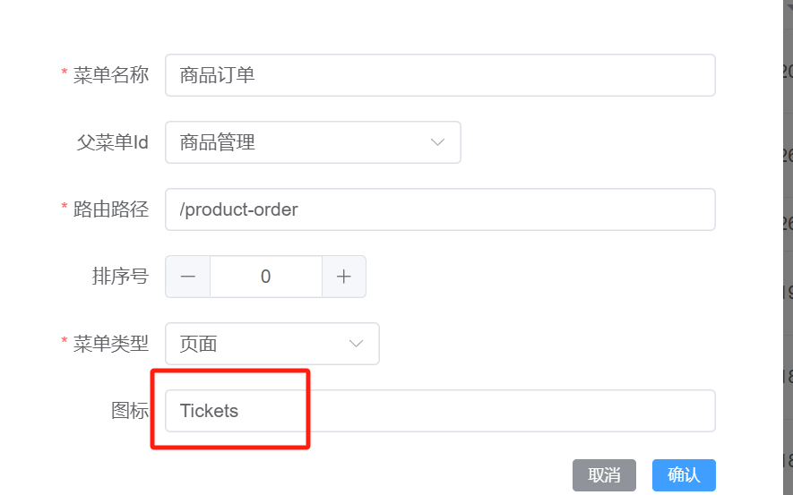
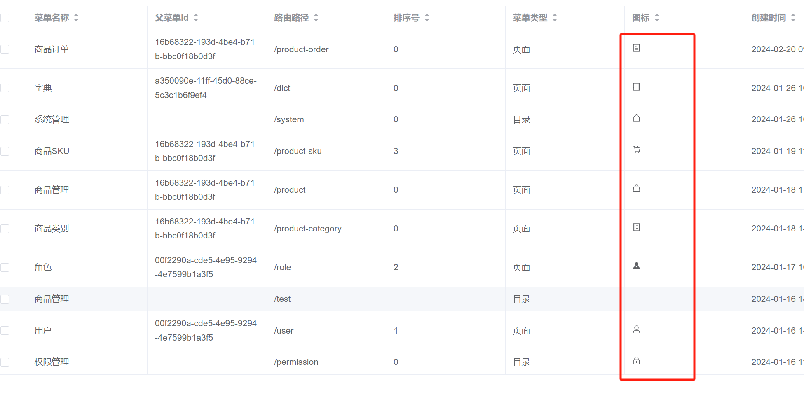
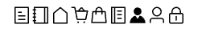

---
category:
  - ElementUI
tag:
  - 动态图标
date: 2024-02-22
timeline: true
---
# Vue+ElementUI动态显示图标




## 安装依赖

```shell
# 选择一个你喜欢的包管理器

# NPM
$ npm install @element-plus/icons-vue
# Yarn
$ yarn add @element-plus/icons-vue
# pnpm
$ pnpm install @element-plus/icons-vue
```

## 正常使用

使用了 Element Plus UI 库来展示一个编辑图标。

1. `<el-icon>`：来自 Element Plus 的组件，用于显示图标。`:size="28"` 表示设置图标的大小为 12px，`:color="'#000'"` 设置图标的颜色为黑色。

2. `<Edit />`：这是一个自定义标签，引用了 Element Plus 图标库中的 `Edit` 图标。

3. `import { Edit } from '@element-plus/icons-vue'`：这一行是导入 Element Plus 图标库中名为 `Edit` 的图标组件。

综上所述，整个组件的作用是在页面上渲染一个大小为12px、颜色为白色的编辑图标。


```vue
<template>
    <el-icon :size="28" :color="'#000'">
        <Edit />
    </el-icon>
</template>
<script setup>
import { Edit } from '@element-plus/icons-vue'

</script>
```

:::info
[官方文档](https://element-plus.gitee.io/zh-CN/component/icon.html#%E7%BB%93%E5%90%88-el-icon-%E4%BD%BF%E7%94%A8)
:::

## 动态显示

## 全局注册图标组件

- 从Element Plus Icons库导入所有的图标组件，以键值对的形式（名称）导出为Vue组件。这样就可以直接在模板中通过名称来使用它们。

    ```ts
    import * as ElementPlusIconsVue from '@element-plus/icons-vue'
    ```

- 遍历ElementPlusIconsVue对象的所有条目，将每个图标组件全局注册到Vue应用中，这样在整个应用中就可以无需单独导入就能使用这些图标组件了。

    ```ts
    for (const [key, component] of Object.entries(ElementPlusIconsVue)) {
        app.component(key, component)
    }
    ```

```ts {5,10-12}
import { createApp } from 'vue'
import { createPinia } from 'pinia'
import ElementPlus from 'element-plus'
import 'element-plus/dist/index.css'
import * as ElementPlusIconsVue from '@element-plus/icons-vue'
import App from './App.vue'
import router from './router'

const app = createApp(App)
for (const [key, component] of Object.entries(ElementPlusIconsVue)) {
  app.component(key, component)
}
app.use(createPinia())
app.use(ElementPlus)
app.use(router)
app.mount('#app')

```

### 动态加载图标组件



这里使用了 Vue 的 `v-for` 指令来遍历一个名为 `iconList` 的 ref 数组。数组中存储的是 Element Plus 图标库中各个图标的名称字符串。对于数组中的每个图标名称，Vue 使用动态组件 `<component>`，并通过 `:is` 特性绑定对应的图标名（即变量 `icon`），这样就可以根据变量值动态地渲染出不同的图标组件。

```vue
<el-icon v-for="(icon, index) in iconList" :key="index">
  <component :is="icon"> </component>
</el-icon>
```

定义了一个响应式引用（ref）变量 `iconList`，其中包含了多个 Element Plus 图标组件的名字。由于之前已经全局注册了所有 Element Plus 图标组件，所以在模板中可以直接通过名字来引用它们。

因此，这段代码会根据 `iconList` 中列出的图标名称列表，动态生成一系列图标，实现了动态加载和显示图标的功能。

```ts
const iconList = ref([
  'Tickets',
  'Notebook',
  'House',
  'ShoppingCartFull',
  'Goods',
  'Memo',
  'Avatar',
  'User',
  'Lock'
])
```

```vue
<template>
    <el-icon v-for="(icon, index) in iconList" :key="index">
        <component :is="icon"> </component>
    </el-icon>
</template>
<script setup>
const iconList = ref([
  'Tickets',
  'Notebook',
  'House',
  'ShoppingCartFull',
  'Goods',
  'Memo',
  'Avatar',
  'User',
  'Lock'
])
</script>
```
