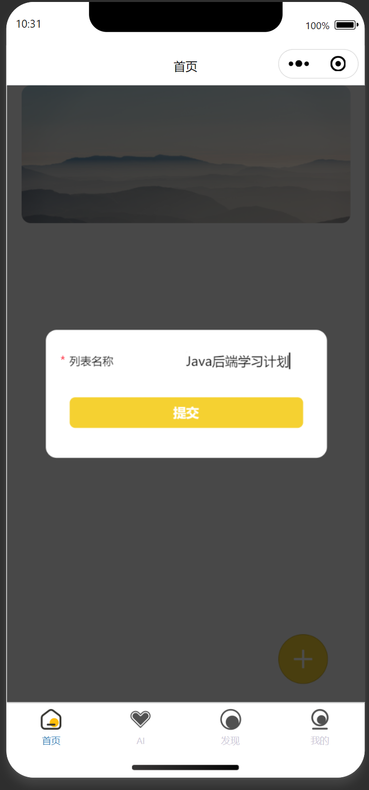
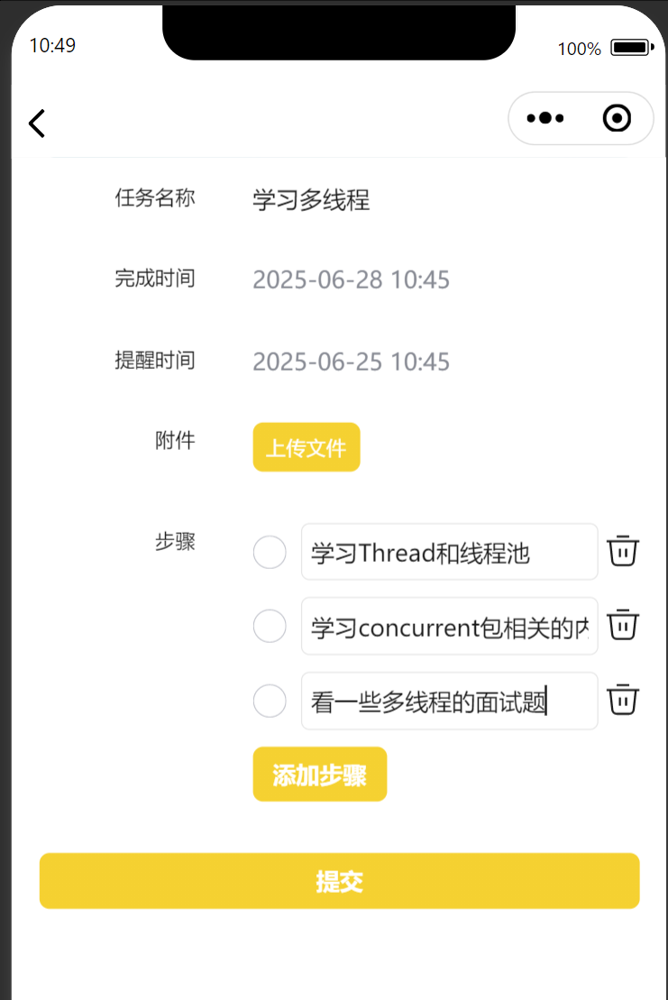
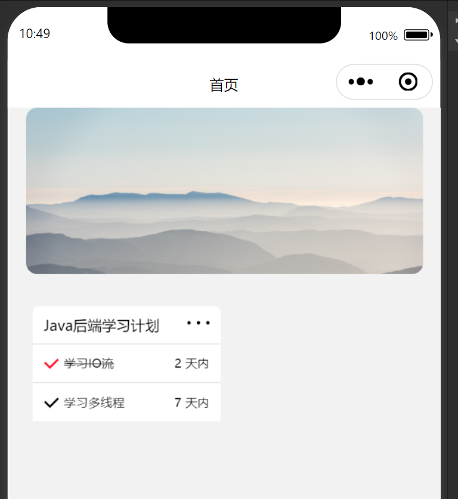
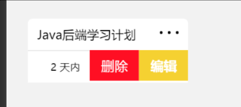
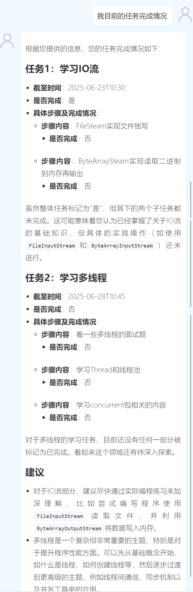
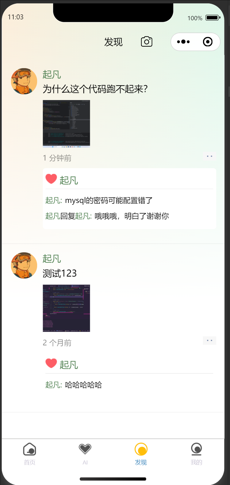

# 项目介绍

可以自己创建任务列表，在任务中细分任务步骤。通过AI助手了解每日需要完成的任务内容。每日签到，累计签到获得成就。

## 使用步骤














## 运行环境

- Java 17
- Node.js 18+
- MySQL 8
- Open AI 协议（大部分厂商都支持）
- Redis
- 阿里云OSS
- IDEA Ultimate 2025
- 微信开发者工具
- 微信小程序账号（用自己的微信申请即可，不需要企业主体）

## 运行步骤

1. clone代码
    ```shell
    git clone https://github.com/qifan777/ai-plan
    ```
2. idea打开项目, 直接用idea打开就可以同时开发后端、管理端、小程序端
3. 修改配置文件, 修改`application.yml`中的
    - API-KEY
    - MySQL
    - Redis
    - 阿里云OSS
    - 微信小程序appid和secret
4. 初始化数据库，新建`ai_plan`数据库导入`database.sql`到数据库
5. 后端运行
    1. 运行ServerApplication.java
    2. target/generated-sources/annotations右键mark directory as/generated source root
6. 管理端运行
    1. cd plan-admin
    2. npm run install
    3. npm run api（先运行后端）
    4. npm run dev
7. 小程序端运行
    1. `pnpm install`
    2. `pnpm api`同步接口和ts类型，先启动后端
    3. `project.config.json`修改`appId`
    4. `pnpm dev:weapp`
    5. 导入`plan-miniprogram`到微信开发者工具
## 技术栈
### Java服务端

| 技术             | 说明                                                                             | 官网                                                               |
|----------------|--------------------------------------------------------------------------------|------------------------------------------------------------------|
| SpringBoot3    | Web应用开发框架，需要JDK17及以上版本                                                         | <https://spring.io/projects/spring-boot>                         |
| SpringAI       | 用一套通用的写法可以对接各个AI                                                               | <https://docs.spring.io/spring-ai/reference/index.html>          |
| SaToken        | 一个轻量级 Java 权限认证框架，主要解决：登录认证、权限认证、单点登录、OAuth2.0、分布式Session会话、微服务网关鉴权 等一系列权限相关问题 | <https://sa-token.cc/>                                           |
| Jimmer         | 不仅有Mybatis的灵活性也有Hibernate的复用性                                                  | <https://babyfish-ct.github.io/jimmer-doc/zh/>                   |
| QiFanGenerator | 自己写的代码生成器，快速生成前后端增删改查。                                                         | 无官网，在代码里面参考`@GenEentity`和`@GenXXXField`注解就行了                     |
| Gradle         | JimmerORM框架搭配Gradle可以大大的提升开发效率，大量的业务DTO类只需要在src/dto中编写重新运行即可生成代码               | <https://gradle.org/>                                            |
| 阿里云OSS         | 存储图片，学习用途基本上免费。                                                                | [对象存储 OSS-阿里云帮助中心 (aliyun.com)](https://help.aliyun.com/zh/oss/) |

### 后台管理端

| 技术             | 说明                                                                | 官网                                     |
|----------------|-------------------------------------------------------------------|----------------------------------------|
| Vite           | 开箱即用的现代前端打包工具                                                     | <https://cn.vitejs.dev/>               |
| Vue3           | Vue 基于标准 HTML 拓展了一套模板语法。Vue 会自动跟踪 JavaScript 状态并在其发生变化时响应式地更新 DOM | <https://cn.vuejs.org/>                |
| Vue Router     | Vue官方路由管理框架                                                       | <https://router.vuejs.org/>            |
| ElementUI Plus | 支持TypeScript提示的Vue3前端UI框架                                         | <https://element-plus.gitee.io/zh-CN/> |
| Pinia          | 全局状态管理框架，支持TypeScript类型提示                                         | <https://pinia.web3doc.top/>           |
| TypeScript     | 让 JS 具备类型声明                                                       | <https://www.typescriptlang.org/>      |
| ESLint         | 语法校验和格式整理                                                         | <https://eslint.org/>                  |
| DayJS          | 日期取值/赋值/运算等操作                                                     | <https://dayjs.fenxianglu.cn/>         |
| LodashJs       | JS各种常用的工具方法                                                       | <https://www.lodashjs.com/>            |

### 微信小程序端

| 技术                 | 说明                                                                                             | 官网                                                             |
|--------------------|------------------------------------------------------------------------------------------------|----------------------------------------------------------------|
| Taro               | 小程序统一开发框架                                                                                      | <https://docs.taro.zone/>                                      |
| React              | React 是一个用于构建用户界面的 JavaScript 库，它允许开发者以组件化的方式创建交互式 UI。React 的核心理念在于声明式编程和组件化结构，这使得开发过程更加直观和高效。 | <https://zh-hans.react.dev/learn>                              |
| NutUI              | 支持TypeScript提示的TaroUI组件库，80+ 高质量组件，覆盖移动端主流场景                                                   | <https://nutui.jd.com/taro/react/3x/#/zh-CN/guide/intro-react> |
| Redux              | 全局状态管理框架，支持TypeScript类型提示                                                                      | <https://cn.redux.js.org/>                                     |
| TypeScript         | 让 JS 具备类型声明                                                                                    | <https://www.typescriptlang.org/>                              |
| ESLint             | 语法校验和格式整理                                                                                      | <https://eslint.org/>                                          |
| ToXml              | 原生的微信小程序组件，用于渲染markdown格式的AI回复                                                                 | <https://github.com/sbfkcel/towxml>                            |
| Eventsource Parser | 将后端AI返回的SSE流解析成格式化的结构                                                                          | <https://github.com/rexxars/eventsource-parser>                |

## 联系方式

付费远程运行/安装/定制开发联系微信：ljc666max

其他关于程序运行安装报错请加QQ群：

- 416765656（满）
- 632067985
