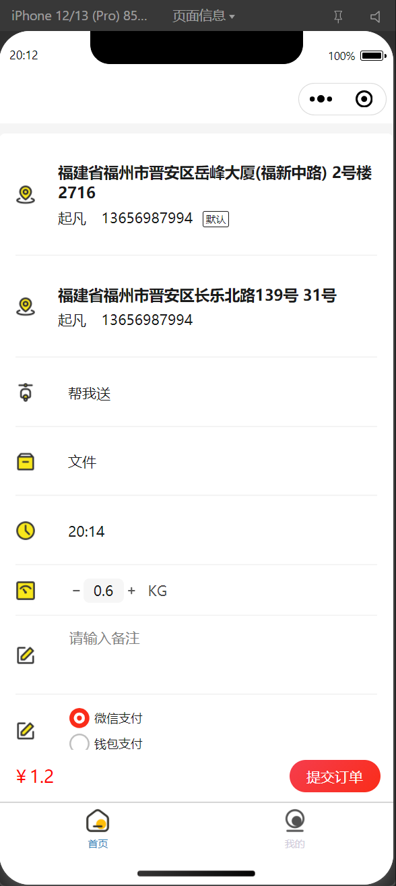

# 项目介绍

College-Help 是一个为大学生提供便捷服务的综合性平台，旨在解决大学生活中的各种需求，提升校园生活质量和效率。该项目采用前后端分离架构，包含管理后台、微信小程序前端和Spring Boot后端服务三大部分。

## 项目预览




## 项目结构

项目采用模块化设计，主要分为以下三个核心模块：

- **college-help-admin**: Vue 3 + TypeScript 开发的管理后台系统，用于平台运营管理和数据监控
- **college-help-backend**: Spring Boot + Java 17 开发的后端服务，提供RESTful API接口和业务逻辑处理
- **college-help-miniprogram**: Taro + React 开发的微信小程序，为学生用户提供便捷的移动端服务

## 技术栈

### 后端技术栈

- **框架**: Spring Boot, Spring Security
- **数据库**: MySQL 8.x, Redis 7.x
- **开发语言**: Java 17
- **认证授权**: Sa-Token
- **ORM框架**: Jimmer
- **API文档**: 自动生成API接口文档
- **其他**: 微信小程序开发SDK, 微信支付SDK, 异步任务处理, 定时任务调度

### 前端技术栈

#### 管理后台

- **框架**: Vue 3 + TypeScript
- **构建工具**: Vite
- **UI组件库**: Element Plus
- **状态管理**: Pinia
- **路由**: Vue Router
- **HTTP客户端**: Axios
- **图表库**: ECharts

#### 微信小程序

- **框架**: Taro (支持多端开发)
- **开发语言**: TypeScript, React
- **状态管理**: Redux
- **日期处理**: dayjs

## 核心功能模块

### 1. 用户管理系统

- **用户注册与登录**: 支持手机号注册、密码登录，以及微信一键登录
- **个人信息管理**: 头像、昵称、性别等基本信息的维护
- **地址管理**: 支持添加、编辑、删除和置顶收货地址，包含经纬度定位功能
- **权限控制**: 基于角色的访问控制系统(RBAC)，区分普通用户和管理员权限

### 2. 任务订单系统

- **任务发布**: 用户可以发布取件(FETCH)或派送(DELIVER)任务
- **任务类型**: 支持多种商品类型，如汽车配件(AUTO_PARTS)、其他物品(OTHER)等
- **任务状态管理**: 包含待支付(TO_BE_PAID)、已完成(FINISHED)、已关闭(CLOSED)等状态
- **地理位置服务**: 支持基于经纬度的精确地址定位和导航
- **接单人机制**: 支持用户承接任务并完成配送
- **任务时间管理**: 支持设定任务开始和结束时间

### 3. 钱包系统

- **钱包管理**: 每个用户拥有独立钱包，可查看实时余额
- **充值功能**: 支持通过微信支付等方式进行钱包充值
- **钱包套餐**: 提供多种充值套餐优惠，如充20赠2、充50赠10、充100赠25等
- **消费记录**: 详细记录所有钱包交易流水，包括充值、提现、任务支付等
- **安全机制**: 支持设置钱包密码，保障资金安全

### 4. 支付系统

- **在线支付**: 集成微信支付SDK，支持多种支付场景
- **订单管理**: 统一的基础订单(base_order)管理，关联各类业务订单
- **支付记录**: 完整记录每笔支付交易的详细信息

### 5. 运营管理功能

- **公告管理**: 平台公告的发布、编辑和删除
- **轮播图管理**: 首页轮播图的配置和管理
- **字典管理**: 系统参数和数据字典的统一管理
- **反馈处理**: 用户反馈的收集和处理

### 6. 数据统计与分析

- **数据可视化**: 通过图表直观展示平台运营数据
- **订单统计**: 任务订单量、完成率、交易额等关键指标统计
- **用户行为分析**: 用户活跃度、使用习惯等数据收集和分析

## 数据库设计

项目采用关系型数据库设计，主要包含以下核心表：

- **用户相关**: `user`(用户信息), `user_we_chat`(微信用户关联), `address`(地址信息)
- **任务相关**: `task_order`(任务订单), `base_order`(基础订单), `deliver`(接单者)
- **钱包相关**: `wallet`(钱包), `wallet_package`(钱包套餐), `wallet_order`(钱包订单), `wallet_record`(钱包记录)
- **系统管理**: `role`(角色), `menu`(菜单), `role_menu_rel`(角色菜单关联), `user_role_rel`(用户角色关联)
- **内容管理**: `notice`(公告), `slideshow`(轮播图), `dict`(字典)
- **交互反馈**: `feedback`(用户反馈), `rating`(订单评价)

## 快速开始

### 代码地址

```shell
git clone https://github.com/qifan777/college-help
```

### 环境要求

- JDK 17或更高版本
- Node.js 20+ 和 npm/yarn/pnpm
- MySQL 8.x
- Redis 7.x
- 微信开发者工具
- 微信小程序（企业个体工商户主体）
- 微信支付
- 阿里云oss
- 腾讯地图api key
- 小程序申请`wx.chooseLocation`权限
- Gradle

### 后端启动

1. 导入sql`database.sql`初始数据库
2. 配置微信支付/小程序/阿里云oss/腾讯地图apiKey
3. 修改`application-dev.yml`中`mysql`和`redis`为你自己的密码
4. 启动`ServerApplication`
5. target/generated-sources/annotations右键mark directory as/generated source root

### 后台管理启动

1. `npm install`
2. `npm run api-admin`同步接口和ts类型，先启动后端
3. `npm run dev`

### 小程序启动

1. `pnpm install`
2. `pnpm api`同步接口和ts类型，先启动后端
3. `project.config.json`修改`appId`
4. `pnpm dev:weapp`
5. 导入`college-help-miniprogram`到微信开发者工具

## 联系方式

- 需要以下服务联系微信：ljc666max
  - 付费远程运行
  - 定制开发
  - 环境租借（微信支付、小程序），仅用于学习跑通流程
- 其他关于程序运行安装报错请加QQ群：
  - 416765656（满）
  - 632067985
