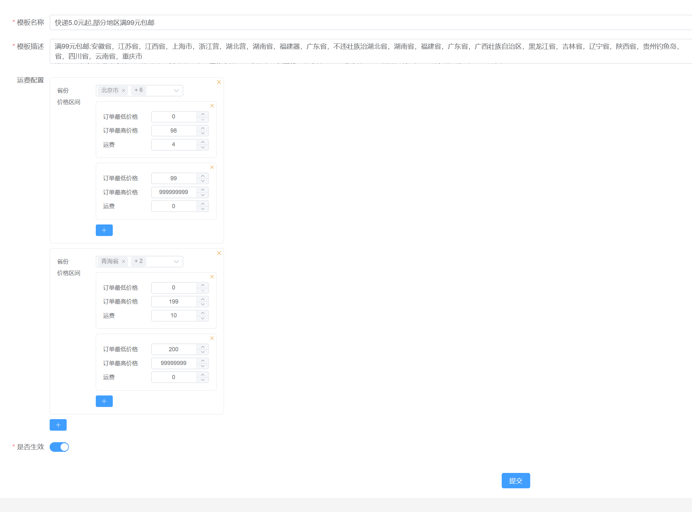

# 运费模板



## 表设计

前端的输入表单可以看见是比较动态且复杂的，这种配置数据适合用json类型存储。`configs`字段用来存储运费配置。

`valid`字段标识全局唯一生效的运费模板。

```sql
create table carriage_template
(
    id           varchar(36)   not null
        primary key,
    created_time datetime(6)   not null,
    edited_time  datetime(6)   not null,
    creator_id   varchar(36)   not null,
    editor_id    varchar(36)   not null,
    name         varchar(255)  not null comment '模板名称',
    description  varchar(1000) not null comment '运费模板描述',
    configs      json          not null comment '运费配置',
    valid        tinyint(1)    not null comment '是否生效（全局只能存在一个生效）'
)
    comment '运费模板';
```

## 模板创建

:::tabs
@tab java

运费模板实体类

`configs`字段在数据库是json类型，在Java中对应的类型是`List<CarriageConfig>`。使用`@Serialized`存入到数据库时会触发json序列化成字符串，读取时触发反序列化成`List<CarriageConfig>`。

```java
@GenEntity
@Entity
public interface CarriageTemplate extends BaseEntity {
    /**
     * 模板名称
     */
    @GenTextField(label = "模板名称", order = 1)
    String name();

    @GenTextAreaField(label = "模板描述", order = 2)
    String description();

    /**
     * 是否生效（全局只能存在一个生效）
     */
    @GenBooleanField
    boolean valid();

    /**
     * 运费配置
     */
    @Serialized
    List<CarriageConfig> configs();
}

```

```java
@Data
public class CarriageConfig {
    /**
     * 省份
     */
    List<String> province;
    /**
     * 运费配置
     */
    List<PriceRange> priceRanges;

    @Data
    public static class PriceRange {
        /**
         * 订单最高价格
         */
        BigDecimal maxPrice;
        /**
         * 订单最低价格
         */
        BigDecimal minPrice;
        /**
         * 运费
         */
        BigDecimal carriage;
    }
}

```

@tab html

观察模板配置图，模板中可以配置多个`CarriageConfig`，每个`CarriageConfig`中可以配多个省份和多个价格区间`PriceRange`。由此构成了两次循环，外面一层循环`carriages`，里面循环`carriage.priceRanges`。

```html
<template>
  <div class="carriages-config">
    <div class="carriage" v-for="(carriage, index2) in carriages" :key="index2">
      <el-form size="small" label-width="80" label-position="left">
        <el-form-item label="省份">
          <el-select multiple v-model="carriage.province" collapse-tags>
            <el-option
              v-for="option in pcaTextArr"
              :key="option.label"
              :value="option.value"
              :label="option.label"
            ></el-option>
          </el-select>
        </el-form-item>
        <el-form-item label="价格区间">
          <div class="price-config">
            <div
              class="price-range-wrapper"
              v-for="(priceRange, index) in carriage.priceRanges"
              :key="index"
            >
              <el-form class="price-range" label-position="left" label-width="100" size="small">
                <el-form-item label="订单最低价格">
                  <el-input-number
                    v-model="priceRange.minPrice"
                    :min="0"
                    controls-position="right"
                  ></el-input-number>
                </el-form-item>
                <el-form-item label="订单最高价格">
                  <el-input-number
                    v-model="priceRange.maxPrice"
                    :min="0"
                    controls-position="right"
                  ></el-input-number>
                </el-form-item>
                <el-form-item label="运费">
                  <el-input-number
                    v-model="priceRange.carriage"
                    controls-position="right"
                  ></el-input-number>
                </el-form-item>
              </el-form>
              <el-button
                class="close"
                type="warning"
                link
                @click="handleDeletePriceRange(carriage, index)"
              >
                <el-icon>
                  <close></close>
                </el-icon>
              </el-button>
            </div>
          </div>
        </el-form-item>
        <el-form-item label=" ">
          <el-button
            class="add"
            type="primary"
            size="small"
            style="margin-top: 10px"
            @click="handleAddPriceRange(carriage)"
          >
            <el-icon>
              <plus></plus>
            </el-icon>
          </el-button>
        </el-form-item>
      </el-form>
      <el-button class="carriage-close" type="warning" link @click="handleDeleteCarriage(index2)">
        <el-icon>
          <close></close>
        </el-icon>
      </el-button>
    </div>
    <el-button
      class="add"
      type="primary"
      size="small"
      style="margin-top: 10px"
      @click="handleAddCarriage"
    >
      <el-icon>
        <plus></plus>
      </el-icon>
    </el-button>
  </div>
</template>
```

@tab ts

```ts
<script setup lang="ts">
import type { CarriageConfig } from '@/apis/__generated/model/static'
// -----中国的省市区配置信息
import { pcaTextArr } from 'element-china-area-data'
import { Close, Plus } from '@element-plus/icons-vue'

const carriages = defineModel<CarriageConfig[]>({ required: true })

// ----- 模板配置增删 -----
const handleAddPriceRange = (carriage: CarriageConfig) => {
  carriage.priceRanges.push({ minPrice: 0, maxPrice: 0, carriage: 0 })
}
const handleDeletePriceRange = (carriage: CarriageConfig, index: number) => {
  carriage.priceRanges.splice(index, 1)
}
// ----- 模板配置增删 -----

// ----- 价格区间增删 -----
const handleDeleteCarriage = (index: number) => {
  carriages.value.splice(index, 1)
}
const handleAddCarriage = () => {
  carriages.value.push({
    province: [],
    priceRanges: []
  })
}
// ----- 价格区间增删 -----
</script>
```

:::

## 运费计算

传入地址id和商品总价计算运费。

- 根据省份匹配适合的模板
- 根据商品总价匹配适合的价格区间

```java
@Service
@Slf4j
@AllArgsConstructor
@Transactional
public class CarriageTemplateService {
    private final CarriageTemplateRepository carriageTemplateRepository;
    private final AddressRepository addressRepository;

    public BigDecimal calculate(String addressId, BigDecimal productAmount) {
        Optional<Address> userAddressOpt = addressRepository.findUserAddressById(addressId);
        if (userAddressOpt.isEmpty()) return BigDecimal.ZERO;
        Address address = userAddressOpt.get();
        return carriageTemplateRepository.findValid()
                .configs()
                .stream()
                .filter(config -> String.join(";", config.getProvince()).contains((address.province())))
                .findFirst()
                .orElseThrow(() -> new BusinessException("当前省份不支持发货请联系客服"))
                .getPriceRanges()
                .stream()
                .filter(priceRange -> productAmount.compareTo(priceRange.getMinPrice()) >= 0 &&
                                      productAmount.compareTo(priceRange.getMaxPrice()) <= 0)
                .findFirst()
                .orElseThrow(() -> new BusinessException("运费模板不适应与该订单，请联系客服"))
                .getCarriage();
    }

}
```
