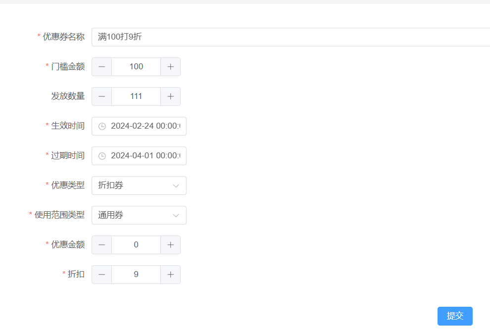
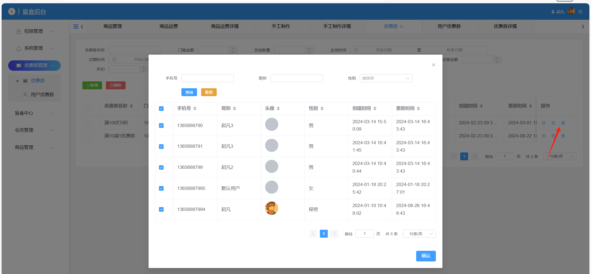

# 优惠券





## 表设计

图1中的表单字段和优惠券表的字段可以一一对应。如果优惠类型是打折，那么`discount`字段就是必填，`amount`字段可为空。如果优惠券类型是满减，那么相反。

```sql
create table coupon
(
    id                varchar(36)    not null
        primary key,
    created_time      datetime(6)    not null,
    edited_time       datetime(6)    not null,
    creator_id        varchar(36)    not null,
    editor_id         varchar(36)    not null,
    name              varchar(255)   not null comment '优惠券名称',
    threshold_amount  decimal(10, 2) not null comment '使用门槛',
    released_quantity int            not null comment '发放数量',
    coupon_type       varchar(36)    not null comment '优惠类型（打折，满减）',
    scope_type        varchar(36)    not null comment '使用范围（通用，指定商品，类别）',
    amount            decimal(10, 2) null comment '优惠金额',
    discount          decimal(4, 2)  null comment '折扣',
    status            tinyint(1)     null comment '是否启用',
    effective_date    datetime       not null comment '生效日期',
    expiration_dae    datetime       not null comment '失效日期',
    constraint coupon_pk
        unique (name)
)
    comment '优惠券';
```

用户优惠券关系表，优惠券的来源有很多种，可以使用`receive_type`表示。这边演示的来源方式只有后台赠送一种。如图2所示，在优惠券上点赠送按钮即可批量选择用户赠送优惠券。

```sql
create table coupon_user_rel
(
    id           varchar(36) not null
        primary key,
    created_time datetime(6) not null,
    edited_time  datetime(6) not null,
    creator_id   varchar(36) not null,
    editor_id    varchar(36) not null,
    receive_type varchar(36) not null comment '获得渠道（后台赠送，手动领取）',
    coupon_id    varchar(36) not null comment '优惠券id',
    status       varchar(36) not null comment '使用状态（待使用，已使用，过期）',
    user_id      varchar(36) not null comment '用户id'
)
    comment '用户优惠券';
```

## 优惠券赠送

::: tabs
@tab vue

通过`<user-choose-table></user-choose-table>`组件加上注入`userTableHelper`提供用户表的分页查询。

选择完需要赠送的用户之后点击确认按钮触发`handleConfirm`，在方法内使用`userTableHelper.getTableSelectedRows()`获取已选的数据，得到`userIds`。

将用户id列表和优惠券id传给`api.couponForAdminController.gift`

```vue
<script setup lang="ts">
import UserChooseTable from '@/views/user/components/user-choose-table.vue'
import { Present } from '@element-plus/icons-vue'
import { provide, ref } from 'vue'
import { api } from '@/utils/api-instance'
import { useTableHelper } from '@/components/base/table/table-helper'
import { ElMessage } from 'element-plus'

const userTableHelper = useTableHelper(
  api.userForAdminController.query,
  api.userForAdminController,
  {}
)
provide('userTableHelper', userTableHelper)
const props = defineProps<{ couponId: string }>()
const visible = ref(false)
const handleConfirm = async () => {
  await api.couponForAdminController.gift({
    body: {
      userIds: userTableHelper.getTableSelectedRows().map((row) => row.id),
      id: props.couponId
    }
  })
  ElMessage.success('赠送成功')
  visible.value = false
}
const handleOpen = () => {
  visible.value = true
  userTableHelper.reloadTableData()
}
</script>

<template>
  <el-button type="primary" link size="small" @click="handleOpen">
    <el-icon>
      <present></present>
    </el-icon>
  </el-button>
  <el-dialog append-to-body v-model="visible">
    <user-choose-table></user-choose-table>
    <template #footer>
      <el-button type="primary" @click="handleConfirm">确认</el-button>
    </template>
  </el-dialog>
</template>

<style scoped lang="scss"></style>
```

@tab java

输入dto用于接收前端的批量赠送优惠券表单

```txt
input CouponGiftInput{
    id!
    userIds: Array<String>
}
```

校验剩余的优惠券是否充足，是否下架

如果满足则向`coupon_user_rel`表插入数据。

```java
    public void gift(CouponGiftInput giftInput) {
        Coupon coupon = couponRepository.findById(giftInput.getId())
                .orElseThrow(() -> new BusinessException(ResultCode.NotFindError, "优惠券不存在"));
        if (coupon.releasedQuantity() - giftInput.getUserIds().length < 0) {
            throw new BusinessException(ResultCode.NotFindError, "优惠券不足");
        }
        if (!coupon.status()) {
            throw new BusinessException(ResultCode.NotFindError, "优惠券已下架");
        }
        List<CouponUserRel> couponUsers = Arrays.stream(giftInput.getUserIds())
                .map(userId -> CouponUserRelDraft.$.produce(draft -> {
                    draft.setCouponId(giftInput.getId())
                            .setUserId(userId)
                            .setReceiveType(DictConstants.CouponReceiveType.GIFT)
                            .setStatus(DictConstants.CouponUseStatus.UNUSED);
                })).collect(Collectors.toList());
        couponUserRelRepository.saveEntities(couponUsers);
    }

```

:::

## 优惠券计算

传入优惠券id，校验是否符使用条件，并根据优惠券的优惠类型（满减，折扣）得到优惠金额。

```java
    public BigDecimal calculate(String id, BigDecimal amount) {
        if (!StringUtils.hasText(id)) return BigDecimal.ZERO;
        CouponUserRel couponUserRel = couponUserRelRepository.findById(id, CouponUserRelRepository.COMPLEX_FETCHER_FOR_ADMIN)
                .orElseThrow(() -> new BusinessException(ResultCode.NotFindError, "优惠券不存在"));
        checkCouponUser(couponUserRel);
        Coupon coupon = couponUserRel.coupon();
        if (coupon.couponType().equals(DictConstants.CouponType.DISCOUNT)) {
            return BigDecimal.TEN.subtract(coupon.discount()).divide(BigDecimal.TEN, RoundingMode.DOWN)
                    .multiply(amount);
        } else if (coupon.couponType().equals(DictConstants.CouponType.REDUCE)) {
            return coupon.amount();
        }
        throw new BusinessException(ResultCode.ParamSetIllegal, "优惠券类型错误");
    }
    
    public void checkCouponUser(CouponUserRel couponUserRel) {
        if (!couponUserRel.status().equals(DictConstants.CouponUseStatus.UNUSED)) {
            throw new BusinessException(ResultCode.ParamSetIllegal, "优惠券已使用");
        }
        if (!couponUserRel.user().id().equals(StpUtil.getLoginIdAsString())) {
            throw new BusinessException(ResultCode.ParamSetIllegal, "优惠券非本人");
        }
        if (!couponUserRel.coupon().effectiveDate().isBefore(LocalDateTime.now())) {
            throw new BusinessException(ResultCode.ParamSetIllegal, "优惠券未生效");
        }
        if (!couponUserRel.coupon().expirationDate().isAfter(LocalDateTime.now())) {
            throw new BusinessException(ResultCode.ParamSetIllegal, "优惠券已过期");
        }
        if (!couponUserRel.coupon().status()) {
            throw new BusinessException(ResultCode.ParamSetIllegal, "优惠券已下架");
        }
    }
```

:::warning
目前的优惠券的使用范围只有通用券一种，如果要拓展品类券和商品券则需要增加两种配置表，并且优惠券计算参数也需要修改。
:::
