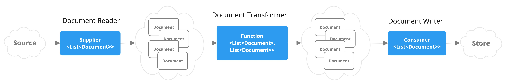

# ETL Pipeline

ETL是提取、转换、加载的缩写，从原始的文档到数据库需要经历提取（.doc、.ppt、.xlsx等）、转换（数据结构化、清理数据、数据分块）、写入向量数据库。这个过程可以进行多种处理，确保最后的数据适合AI问答。

SpringAI提供了ETL框架。它是搭建知识库框架的基石。

## 框架介绍

1. DocumentReader：文档读取器，读取文档，比如PDF、Word、Excel等。如：`JsonReader`（读取JSON）,`TextReader`（读取文本）,`PagePdfDocumentReader`（读取PDF）,`TikaDocumentReader`（读取各种文件，大部分都可以支持.pdf,.xlsx,.docx,.pptx,.md,.json等）。上诉的这些reader都是`DocumentReader`的实现类。
2. DocumentTransformer：文档转换器，处理文档。`TextSplitter`（文档切割成小块），`ContentFormatTransformer`（将文档变成键值对），`SummaryMetadataEnricher`（使用大模型总结文档），`KeywordMetadataEnricher`（使用大模型提取文档关键词）。
3. DocumentWriter: 文档写入器，将文档写入向量数据库或者本地文件。`VectorStore`（向量数据库写入器），`FileDocumentWriter`（文件写入器）。



## 读取文件

`TikaDocumentReader`比较全能大部分文件都可以读取，支持的文件格式可以参考[官方文档](https://tika.apache.org/2.9.0/formats.html)。如果是比较个性化文档的场景，最好自己实现一个`Reader`，比如我们公司的有些excel里面存了各种的表格数据这种只能自己去读取处理。使用读取器读出来的数据乱乱的。

引入依赖

```xml
        <dependency>
            <groupId>org.springframework.ai</groupId>
            <artifactId>spring-ai-tika-document-reader</artifactId>
        </dependency>

```

首先要明白`DocumentReader`会从`Resource`中读取文件。`Resource`是SpringIO中的一个接口，它表示一个资源，可以是文件、网络资源、内存资源等。
下面举几个读取文件的例子

1. 从输入流中读取文件。像后端接收前端文件时，就可以使用。

    ```java
    @SneakyThrows
    @PostMapping("read/multipart-file")
    public void readMultipartFile(@RequestParam MultipartFile file) {
        // 从IO流中读取文件
        Resource resource = new InputStreamResource(file.getInputStream());
        List<Document> documents = new TikaDocumentReader(resource)
                .read();
    }
    ```

2. 从本地文件读取文件。

    ```java
    public void readFile() {
        Resource resource = new FileSystemResource("D:\\简历.pdf");
        List<Document> documents = new TikaDocumentReader(resource)
                .read();
    }
    ```

3. 从网络资源读取文件。

    ```java
    @SneakyThrows
    public void readUrl() {
        Resource resource = new UrlResource("http://localhost/简历.pdf");
        List<Document> documents = new TikaDocumentReader(resource)
                .read();
    }
    ```

为了体现资源的统一性我特意用`Resource`表示`InputStreamResource`、`FileSystemResource`、`UrlResource`。对于文档读取器来说，它不在乎文档来自哪里，只要它是一个`Resource`，它都可以读取。

## 转换文档

`Document`对象是`ETL Pipeline`的核心对象，它包含了文档的元数据和内容。

内容转换器：

- `TokenTextSplitter`：可以把内容切割成更小的块方便`RAG`的时候提升响应速度节省`Token`。
- `ContentFormatTransformer`：可以把元数据的内容变成键值对字符串。

元数据转换器：

- `SummaryMetadataEnricher`：使用大模型总结文档。会在元数据里面增加一个`summary`字段。
- `KeywordMetadataEnricher`：使用大模型提取文档关键词。可以在元数据里面增加一个`keywords`字段。

从前端传来文件，使用`TikaDocumentReader`读取文件，然后使用`TokenTextSplitter`将文本内容划分成更小的块。

```java
        // 从IO流中读取文件
        TikaDocumentReader tikaDocumentReader = new TikaDocumentReader(new InputStreamResource(file.getInputStream()));
        // 将文本内容划分成更小的块
        List<Document> splitDocuments = new TokenTextSplitter()
                .apply(tikaDocumentReader.read());
```

## 存储文档

经过前面的步骤，我们得到了一个文档列表，然后就可以将其存储到向量数据库或者本地文件中了。

向量数据库的依赖和创建请参考[向量数据库](./vector-database.md)。

```java
    // 注入向量数据库。
    private final VectorStore vectorStore;
    @SneakyThrows
    @PostMapping("embedding")
    public Boolean embedding(@RequestParam MultipartFile file) {
        // 从IO流中读取文件
        TikaDocumentReader tikaDocumentReader = new TikaDocumentReader(new InputStreamResource(file.getInputStream()));
        // 将文本内容划分成更小的块
        List<Document> splitDocuments = new TokenTextSplitter()
                .apply(tikaDocumentReader.read());
        // 存入向量数据库，这个过程会自动调用embeddingModel,将文本变成向量再存入。
        vectorStore.add(splitDocuments);
        return true;
    }
```
