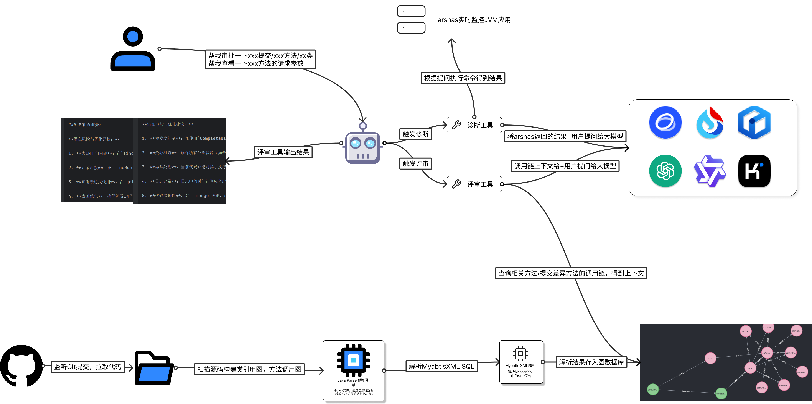
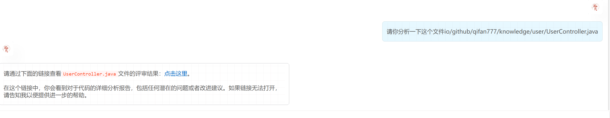
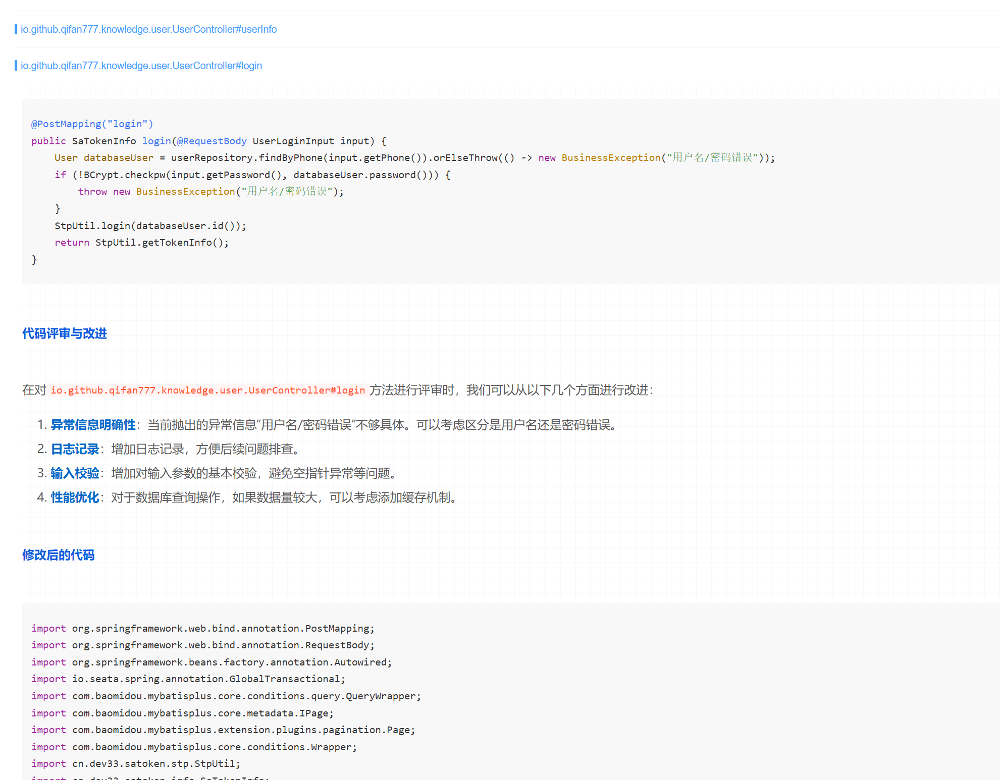
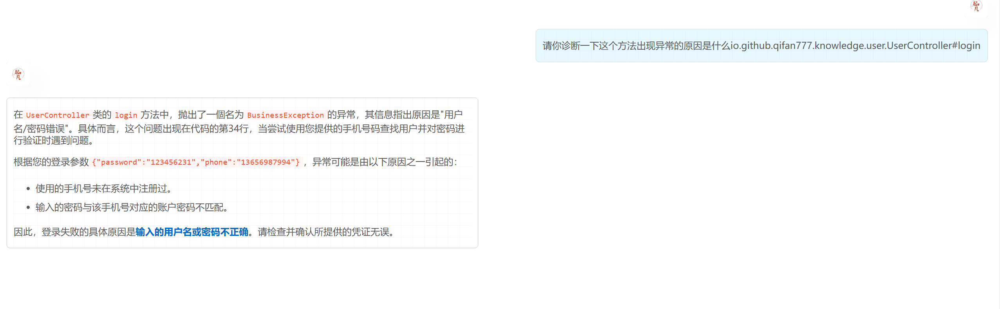

# 助手介绍



通过`CodeAssistantAgent`选择适合用户提问的工具，并提取出参数进行调用[代码分析工具](./analyze-tool.md)或者[代码诊断工具](./diagnose-tool.md)。这两个工具底层都借助了代码关系图谱，当分析代码是有了方法调用链可以让ai更好的分析出潜在bug。在出现异常信息时，有了方法调用链接可以定位到是哪个代码片段出了问题。

## 使用介绍

1. application.yml中配置好项目的目录

    ```yml
    code-assistant:
    project:
        project-path: F:\workspace\code\opensource\dive-into-spring-ai
    ```

2. 安装neo4j

    安装完neo4j访问`localhost:7474`, 默认的账号密码都是`neo4j`和`neo4j`。把密码改成`12345678`

    ```shell
    docker run \
        -d \
        -p 7474:7474 -p 7687:7687 \
        -v neo4j-data:/data -v neo4j-data:/plugins \
        --name neo4j \
        -e NEO4J_apoc_export_file_enabled=true \
        -e NEO4J_apoc_import_file_enabled=true \
        -e NEO4J_apoc_import_file_use__neo4j__config=true \
        -e NEO4JLABS_PLUGINS=\[\"apoc\"\] \
        -e NEO4J_dbms_security_procedures_unrestricted=apoc.\\\* \
        neo4j
    ```

3. 配置neo4j

    ```yml
    neo4j:
        authentication:
        username: neo4j
        password: 12345678
        uri: bolt://localhost:7687
    ```

4. 构建代码关系图谱
    post调用下面的接口即可开始构建指定项目的代码关系

    ```shell
    POST http://localhost:9902/code/graph/build
    ```

### 代码分析工具

1. 在右侧面板中打开`agent`开关，并提问，提问的参数格式如下：
    `io/github/qifan777/knowledge/user/UserController.java`

    
2. 在新页签中打开链接，查看分析结果

    

### 代码诊断工具

1. 在arthas官网下载jar包，运行起来并监听项目

    ```shell
    java -jar arthas-boot.jar
    ```

2. 在右侧的面板中打开`agent`开关，在聊天页面中提问的参数格式：`全限定类名#方法名称`，等待ai调用arthas监听目标方法的调用。

    

3. 在页面中调用指定的接口，复现异常，此时arthas监听到方法出现了异常把异常信息和参数返回给ai分析
