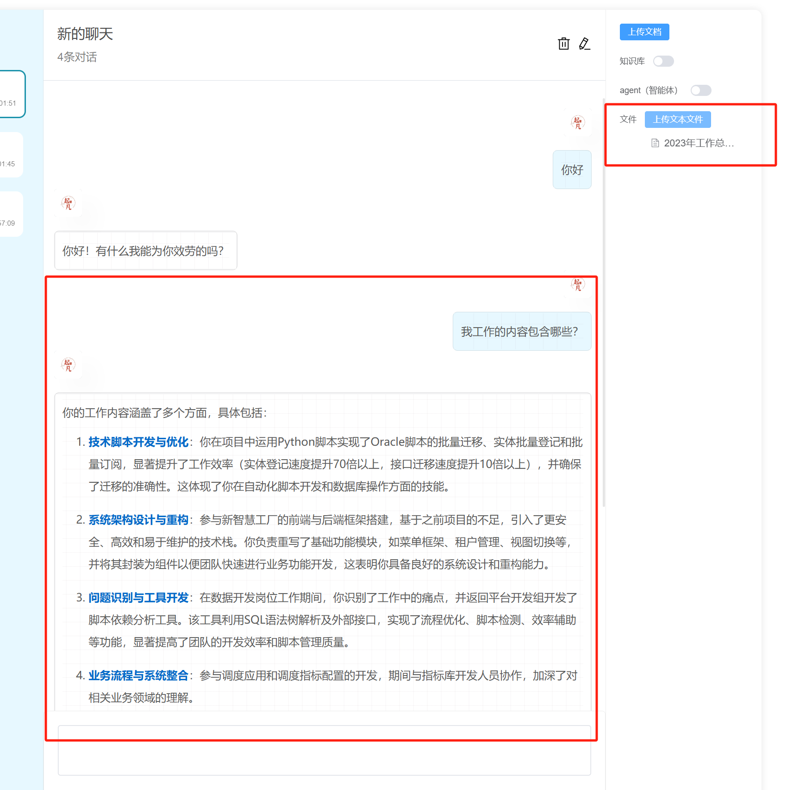

# 文件问答

如果你的数据量并没有非常的庞大，也不想做复杂的向量数据库构建，还有一种知识库方案就是直接读取文件的内容作为上下文问答。



## 后端消息接收

之前接收前端的提问内容和拓展参数是这样的

```java
    @PostMapping(value = "chat", produces = MediaType.TEXT_EVENT_STREAM_VALUE)
    public Flux<ServerSentEvent<String>> chat(@RequestBody AiMessageWrapper input)
```

现在为了接收文件，之前的json体就不适用了。因此需要将Content-Type 从 `application/json` 修改为 `multipart/form-data`。`multipart/form-data`顾名思义可以接收多个part，每个part都可以有自己的内容类型。所以它支持既可以上次json，也可以上传文件二进制流。

参数解释：

- input: `AiMessageWrapper` json体。之前接收请求参数是用@RequestBody, 现在使用@RequestPart 接收json字符串再手动转成AiMessageWrapper.

- file: 需要问答的文件。

```java
    @PostMapping(value = "chat", produces = MediaType.TEXT_EVENT_STREAM_VALUE)
    public Flux<ServerSentEvent<String>> chat(@RequestPart String input, @RequestPart(required = false) MultipartFile file) {
```

:::tip
SpringMVC的`@RequestPart`是支持自动将Json字符串转换为Java对象，也就是说可以等效`@RequestBody`，但是由于前端FormData无法设置Part的Content-Type，所以只能手动转json字符串再转成Java对象。
:::

## 文件读取

将接收到的文件传给`useFile`，该方法会使用`TikaDocumentReader`读取文件内容，并拼接到`System`中。

```java
    @SneakyThrows
    @PostMapping(value = "chat", produces = MediaType.TEXT_EVENT_STREAM_VALUE)
    public Flux<ServerSentEvent<String>> chat(@RequestPart String input, @RequestPart(required = false) MultipartFile file) {
        AiMessageWrapper aiMessageWrapper = objectMapper.readValue(input, AiMessageWrapper.class);
        /*
        * 忽略...
        */
        return ChatClient.create(chatModel).prompt()
                // 启用文件问答
                .system(promptSystemSpec -> useFile(promptSystemSpec, file))
                /*
                * 忽略...
                */                
                .stream()
                .chatResponse()
                .map(chatResponse -> ServerSentEvent.builder(toJson(chatResponse))
                        // 和前端监听的事件相对应
                        .event("message")
                        .build());
    }

    @SneakyThrows
    public void useFile(ChatClient.PromptSystemSpec spec, MultipartFile file) {
        if (file == null) return;
        String content = new TikaDocumentReader(new InputStreamResource(file.getInputStream())).get().get(0).getContent();
        Message message = new PromptTemplate("""
                已下内容是额外的知识，在你回答问题时可以参考下面的内容
                ---------------------
                {context}
                ---------------------
                """)
                .createMessage(Map.of("context", content));
        spec.text(message.getContent());
    }
```

## 前端消息发送

用户选择本地文件，读取到内存中。此时并不需要上传到后端。

```ts
const fileList = ref<UploadUserFile[]>([])
```

```html
          <el-form-item label="文件">
            <div class="upload">
              <el-upload v-model:file-list="fileList" :auto-upload="false" :limit="1">
                <el-button type="primary">上传文本文件</el-button>
              </el-upload>
            </div>
          </el-form-item>
```

发送消息的时候把文件的二进制内容一起发送上去。formData对象的key需要对应后端的`@RequestPart`的参数名称。

```ts
  const form = new FormData()
  form.set('input', JSON.stringify(body))

  if (fileList.value.length && fileList.value[0].raw) {
    form.append('file', fileList.value[0].raw)
  }
  const evtSource = new SSE(API_PREFIX + '/message/chat', {
    withCredentials: true,
    // 禁用自动启动，需要调用stream()方法才能发起请求
    start: false,
    payload: form as any,
    method: 'POST'
  })
```
