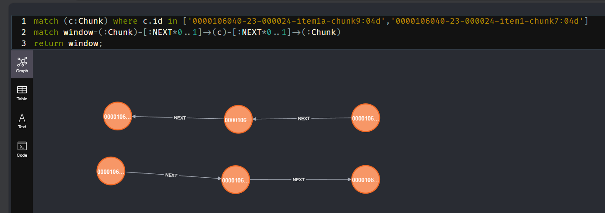
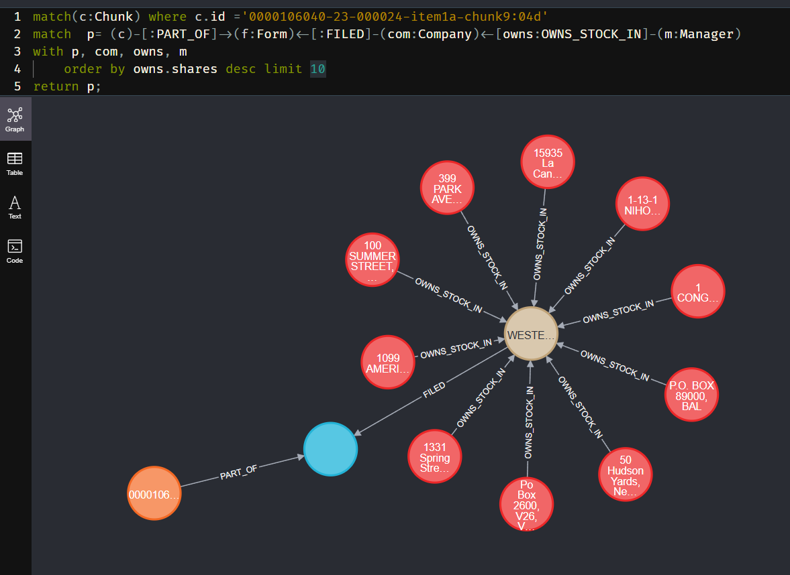

# GraphRag案例

## Chunk RAG

为了防止大模型的context过大，我们一般会把原始的文本切割成小块然后嵌入到向量数据库中。当用户提问的时候就去向量数据库中查询相关的Chunk，这样就可以只取出原始文本的一小部分作为上下文信息给AI。

这样也会产生一个弊端，就是原始文本的结构丢失了，比如有些信息在这个Chunk的上面或者下面，但是被切割了导致信息丢失。下面我们借助图数据库的关系查询能力将Chunk结合上下游还原文本。

### 关联上下游Chunk Cypher

```cypher
CALL db.index.vector.queryNodes('form_10k_chunks', 1, $embedding)
yield node, score
match window=(:Chunk)-[:NEXT*0..1]->(node)-[:NEXT*0..1]->(:Chunk)
with nodes(window) as chunkList, node, score
unwind chunkList as chunkRows
with collect(chunkRows.text) as textList, node, score
return apoc.text.join(textList, " \n ")
```

1. **查询相似节点**

    查询语句接收一个向量，然后返回最相关的节点。这个向量一般是用户的提问通过模型生成的向量。如果你是要做推荐系统，这个地方的向量可以是其他节点的向量。
    [Chunk Embeding](./chunk.md#chunk嵌入)中已经创建了一个索引，使用`db.index.vector.queryNodes`在索引上查询到最相关的Chunk。

2. **窗口捕获**

    可以看到，在查询语句中，最相关的Chunk以及下游节点被赋值到`window`中。由于
    并把这些Chunk距离为1的下游和下游节点也查出来，最大程度保证原始的文本结构不会丢失。

    查询出来的结果差不多是这样的。由于我上面限制了只查询最相关的1个chunk，因此实际查询出来只有一条链。
    

3. **字符串拼接**
    通过`nodes`函数将Chunk链转成Chunk列表，然后使用[unwind](https://neo4j.com/docs/cypher-manual/current/clauses/unwind/)关键字将Chunk列表转成行。
    使用`collect`函数对chunkRows转成文本列表，并调用存储过程`apoc.text.join`将文本列表转成文本。

### Chunk RAG实现

1. 用户的提问`query`转向量（`embed`）
2. 使用`embed`作为查询参数传给上面介绍的查询语句，查询最相关的Chunk以及下游节点并转成文本（`result`）
3. 创建`promptTemplate`模板，用于拼接上下文。
4. `result`填充`promptTemplate`模板得到`content`
5. 将用户提问`query`和`content`拼接起来，调用chat模型

```java
    // 嵌入模型用灵积
    private final DashScopeAiEmbeddingModel embeddingModel;
    // 推荐使用kimi，上下文支持的token数比较大
    private final MoonshotChatModel chatModel;
    private final Neo4jClient neo4jClient;
    private final PromptTemplate promptTemplate = new PromptTemplate("""
            Context information is below.
            ---------------------
            {question_answer_context}
            ---------------------
            Given the context and provided history information and not prior knowledge,
            reply to the user comment. If the answer is not in the context, inform
            the user that you can't answer the question.
            """);

    @GetMapping(value = "chunk/rag")
    public String chunkRag(@RequestParam String query) {
        List<Double> embed = embeddingModel.embed(query);
        String result = neo4jClient.query("""
                        CALL db.index.vector.queryNodes('form_10k_chunks', 1, $embedding)
                        yield node, score
                        match window=(:Chunk)-[:NEXT*0..1]->(node)-[:NEXT*0..1]->(:Chunk)
                        with nodes(window) as chunkList, node, score
                        unwind chunkList as chunkRows
                        with collect(chunkRows.text) as textList, node, score
                        return apoc.text.join(textList, " \\n ")
                        """)
                .bind(embed).to("embedding")
                .fetchAs(String.class).first()
                .orElseThrow(() -> new BusinessException("未找到相似文档"));
        String content = promptTemplate.createMessage(Map.of("question_answer_context", result)).getContent();
        return chatModel.call(new UserMessage(content + "\n" + query));
    }
```

### 测试

提问: Tell me about Netapp's business.

回复结果：

NetApp is a company that specializes in providing cloud-based software for managing storage infrastructure. They offer a range of products and services for data management, storage, and cloud operations. Their main products include NetApp Cloud Volumes ONTAP, a cloud-based software for customers who wish to manage their own cloud storage infrastructure, and NetApp BlueXP, a unified control plane that enables customers to manage their entire data landscape.

NetApp's cloud storage offerings are available on major cloud platforms such as Microsoft Azure, Amazon Web Services, and Google Cloud. They provide services like data migration, storage efficiency, backup and restore, compliance, and caching to help customers optimize their data management.

In addition to cloud storage, NetApp also offers professional and support services, including strategic consulting, professional services, managed services, and support services to help customers with assessment, design, implementation, migration, and optimization of their storage environments.

NetApp's customer base is diverse, spanning various industry segments and vertical markets. They have partnerships with leading cloud, infrastructure, consulting, application, and reseller partners to ensure the success of their customers.

NetApp uses a multichannel distribution strategy, selling their products and services through a direct sales force and an ecosystem of partners, including the leading cloud providers. They focus on building brand reputation, creating market awareness, and generating demand for their products and services.

As of April 28, 2023, NetApp has a worldwide sales and marketing team consisting of approximately 5,700 managers, sales representatives, and technical support personnel, with offices in approximately 25 countries. Sales through indirect channels represented 78% of their net revenues in fiscal 2023.

## 投资方（Manager） RAG

当用户想查询某个公司的投资方时，上面的例子就无法满足需求了，此时需要关联更多的信息提供上下文给ai

### 关联投资方Cypher

```cypher
CALL db.index.vector.queryNodes('form_10k_chunks', 1, $embedding)
YIELD node, score
MATCH (node)-[:PART_OF]->(f:Form),
    (f)<-[:FILED]-(com:Company),
    (com)<-[owns:OWNS_STOCK_IN]-(mgr:Manager)
WITH node, score, mgr, owns, com
    ORDER BY owns.shares DESC LIMIT 5
WITH collect (
    mgr.name +
    " owns " + owns.shares + " of " + com.name +
    " at a value of $" + apoc.number.format(owns.value) + "."
) AS investment_statements, node, score
RETURN "investors: \\n" + apoc.text.join(investment_statements, "\\n") +\s
    "\\n" + node.text AS text
```

1. **查询相似节点**
2. **关联投资方**

    假设我们查询到的最相关Chunk是图中的黄色节点，然后通过`PartOf`关系找到`Form`（蓝色），之后通过`Filed`关系找到`Company`（棕色），最后`OwnsStockIn`关系找到`Manager`（红色）。

    
3. **排序过滤**
    使用with语句可以将查询结果保存起来，然后使用order by和limit语句对结果进行排序和过滤。
4. **拼接投资方和Chunk信息**
    使用`collect`函数将投资方信息转成文本列表，然后使用`apoc.text.join`将文本列表转成一段文本。包含了投资方信息和Chunk信息。

### Manager RAG实现

请参考[Chunk Rag实现](#chunk-rag实现)

```java
    @GetMapping(value = "manager/rag")
    public String managerRag(@RequestParam String query) {
        List<Double> embed = embeddingModel.embed(query);
        var result = neo4jClient.query("""
                        CALL db.index.vector.queryNodes('form_10k_chunks', 1, $embedding)
                        YIELD node, score
                        MATCH (node)-[:PART_OF]->(f:Form),
                            (f)<-[:FILED]-(com:Company),
                            (com)<-[owns:OWNS_STOCK_IN]-(mgr:Manager)
                        WITH node, score, mgr, owns, com
                            ORDER BY owns.shares DESC LIMIT 5
                        WITH collect (
                            mgr.name +
                            " owns " + owns.shares + " of " + com.name +
                            " at a value of $" + apoc.number.format(owns.value) + "."
                        ) AS investment_statements, node, score
                        RETURN "investors: \\n" + apoc.text.join(investment_statements, "\\n") +\s
                            "\\n" + node.text AS text
                        """)
                .bind(embed).to("embedding")
                .fetchAs(String.class)
                .first()
                .orElseThrow(() -> new BusinessException("未找到相似文档"));
        String content = promptTemplate.createMessage(Map.of("question_answer_context", result)).getContent();
        log.info("context result: {}", content);
        return chatModel.call(new UserMessage(content + "\n" + query));
    }
```

### 测试

提问：In a single sentence, tell me about Netapp investors.

回答结果：

NetApp Inc. has several investors, with the top ones being entities located in Valley Forge, PA, New York, NY, Pasadena, CA, Los Angeles, CA, and Boston, MA, each owning millions of shares valued in billions of dollars.

将ai的回答结果对比一下图数据库中的内容，可以发现是正确的

图数据库查询结果：

Po Box 2600, V26, Valley Forge, PA, 19482-2600 owns 2.7643006E7 of NETAPP INC at a value of $2,111,925,659,000.
50 Hudson Yards, New York, NY, 10001 owns 1.8241407E7 of NETAPP INC at a value of $1,393,643,480,000.
177 EAST COLORADO BLVD., 11TH FLOOR, PASADENA, CA, 91105 owns 1.5480084E7 of NETAPP INC at a value of $1,182,678,418,000.
333 South Hope Street, 55th Fl, Los Angeles, CA, 90071 owns 1.3694095E7 of NETAPP INC at a value of $1,046,201,517,000.
1 CONGRESS STREET, SUITE 1, BOSTON, MA, 02114 owns 9321206.0 of NETAPP INC at a value of $712,140,138,000.
