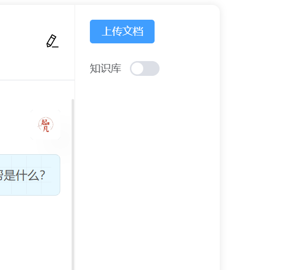

# 知识库

## 前端实现



前端需要有一个知识库开关让用户决定本次的查询是否要使用知识库。也需要有一个上传文件的功能，提取出文件中的内容，然后转向量再存入向量数据库。

### 额外参数面板

这个面板可以放一些额外的参数，如后面还可以选择`function call`，设置模型参数等。

目前在这个面板我放了上传文档功能和知识库开关。

```html
<div class="option-panel">
    <el-form>
        <el-form-item>
        <el-upload
            v-loading="embeddingLoading"
            :action="`${API_PREFIX}/document/embedding`"
            :show-file-list="false"
            :on-success="onUploadSuccess"
            :before-upload="beforeUpload"
        >
            <el-button type="primary">上传文档</el-button>
        </el-upload>
        </el-form-item>
        <el-form-item label="知识库">
        <el-switch v-model="options.enableVectorStore"></el-switch>
        </el-form-item>
    </el-form>
</div>
```

上传文件的时候要loading一下，避免用户多次重复上传。

```ts
const API_PREFIX = import.meta.env.VITE_API_PREFIX
const options = ref({
  enableVectorStore: false
})
const embeddingLoading = ref(false)
const onUploadSuccess = () => {
  embeddingLoading.value = false
  ElMessage.success('上传成功')
}
const beforeUpload: UploadProps['beforeUpload'] = (file) => {
  embeddingLoading.value = true
  return true
}
```

### 发送消息携带额外的参数

根据后端实现可以知道，前端发送消息的时候，需要携带额外的参数，这里我直接在`body`中添加了`params`字段。也就是是否启用知识库

```ts
     
  const body: AiMessageWrapper = { message: chatMessage, params: options.value }
  const evtSource = new SSE(API_PREFIX + '/message/chat', {
    withCredentials: true,
    // 禁用自动启动，需要调用stream()方法才能发起请求
    start: false,
    headers: { 'Content-Type': 'application/json' },
    payload: JSON.stringify(body),
    method: 'POST'
  })
```

后续的消息回复逻辑请参考[聊天面板前端实现](./chat-page/frontend.md)

## 后端实现

### 消息dto改造

将之前的 `AiMessageInput` 改造成 `AiMessageWrapper`，新增了一个 `params` 属性，用来传递一些参数。前端可以选择是否开启知识库。

```java
@Data
public class AiMessageWrapper {
    AiMessageInput message;
    AiMessageParams params;
}
@Data
public class AiMessageParams {
    Boolean enableVectorStore;
}
```

### QuestionAnswerAdvisor

之前已经介绍过[RAG](./basic/rag.md)，请参考之前的教程。

```java

    /**
     * @param input 消息包含文本信息，会话id，多媒体信息（图片语言）。参考src/main/dto/AiMessage.dto
     * @return SSE流
     */
    @PostMapping(value = "chat", produces = MediaType.TEXT_EVENT_STREAM_VALUE)
    public Flux<ServerSentEvent<String>> chatStreamWithHistory(@RequestBody AiMessageWrapper input) {
        return ChatClient.create(dashScopeAiChatModel).prompt()
                .user(promptUserSpec -> toPrompt(promptUserSpec, input.getMessage()))
                .advisors(advisorSpec -> {
                    // 使用历史消息
                    useChatHistory(advisorSpec, input.getMessage().getSessionId());
                    // 如果启用向量数据库
                    if (input.getParams().getEnableVectorStore()) {
                        // 使用向量数据库w
                        useVectorStore(advisorSpec);
                    }
                })
                .stream()
                .chatResponse()
                .map(chatResponse -> ServerSentEvent.builder(toJson(chatResponse))
                        // 和前端监听的事件相对应
                        .event("message")
                        .build());
    }
    
    public void useVectorStore(ChatClient.AdvisorSpec advisorSpec) {
        // question_answer_context是一个占位符，会替换成向量数据库中查询到的文档。QuestionAnswerAdvisor会替换。
        String promptWithContext = """
                下面是上下文信息
                ---------------------
                {question_answer_context}
                ---------------------
                给定的上下文和提供的历史信息，而不是事先的知识，回复用户的意见。如果答案不在上下文中，告诉用户你不能回答这个问题。
                """;
        advisorSpec.advisors(new QuestionAnswerAdvisor(vectorStore, SearchRequest.defaults(), promptWithContext));
    }
```
