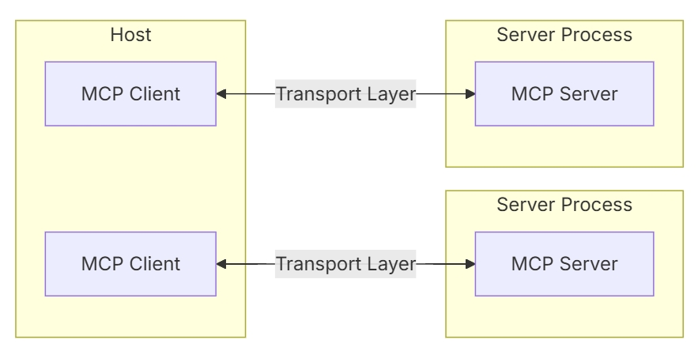

# MCP



MCP协议由上图所示的三个部分组成

- MCP Server
- MCP Client
- Transport Layer

MCP Server提供了多个工具， MCP Client可以通过Transport Layer（SSE协议、命令行调用等）调用MCP Server提供的工具。

## MCP调用

如果不考虑AI，我们可以自己尝试手动发起MCP Client连接并调用MCP Server提供的工具。
### 安装MCP Server

选一个自己喜欢的GitHub开源[MCP Server](https://github.com/modelcontextprotocol/servers), 下面以[mcp-playwright（操控浏览器的相关工具）](https://github.com/executeautomation/mcp-playwright)为例子讲解如何使用MCP Client调用MCP Server提供的工具。

1. 安装node.js
2. `npm install -g @executeautomation/playwright-mcp-server`，相当于把软件安装到本地后续通过`npx`即可调用MCP Server.


注意：有些是MCP Server是用python写的，需要用uvx或者docker

### MCP Client创建

```xml
<dependency>
    <groupId>org.springframework.ai</groupId>
    <artifactId>spring-ai-starter-mcp-client</artifactId>
</dependency>
```

```java
@Slf4j
public class MCPTest {
    @Test
    public void test() {
        // 定义和MCP Server连接的参数
        ServerParameters parameters = ServerParameters
                // windows需要加后缀.cmd 其他系统不需要
                .builder("npx.cmd")
                .args("-y", "@executeautomation/playwright-mcp-server")
                .build();
        // 命令行调用协议
        StdioClientTransport transport = new StdioClientTransport(parameters);
        // 创建MCP客户端
        McpSyncClient client = McpClient.sync(transport).build();
        // 初始化MCP客户端
        client.initialize();
        // 查看MCP Sever提供的工具列表
        log.info("tools: {}", client.listTools());
        McpSchema.CallToolResult result = client.callTool(new McpSchema.CallToolRequest("playwright_navigate", Map.of("url", "https://www.jarcheng.top")));
        log.info("result: {}", result);

    }
}
```


