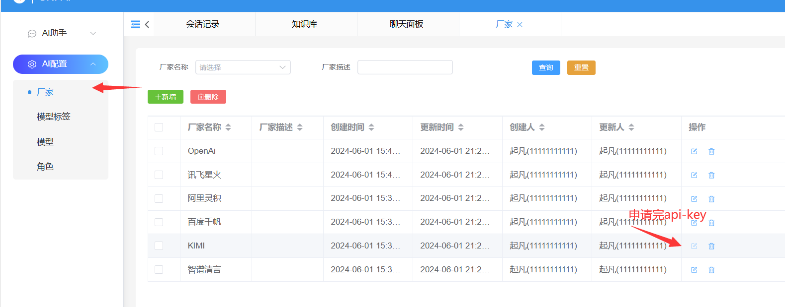
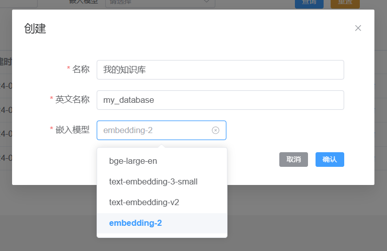
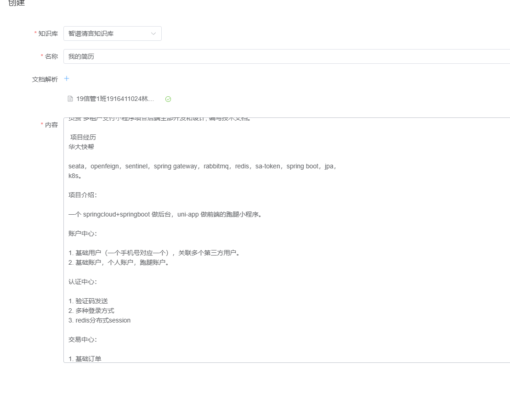
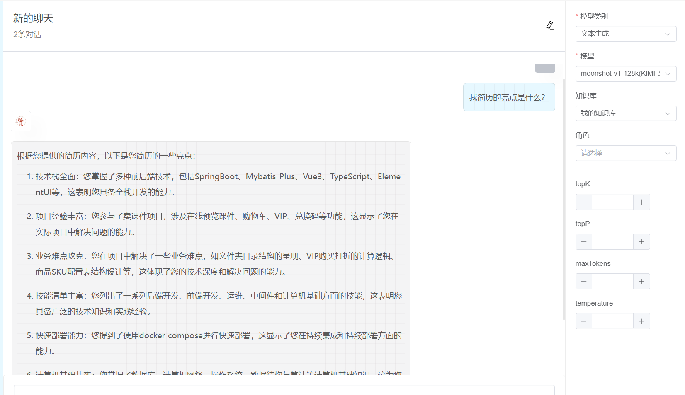
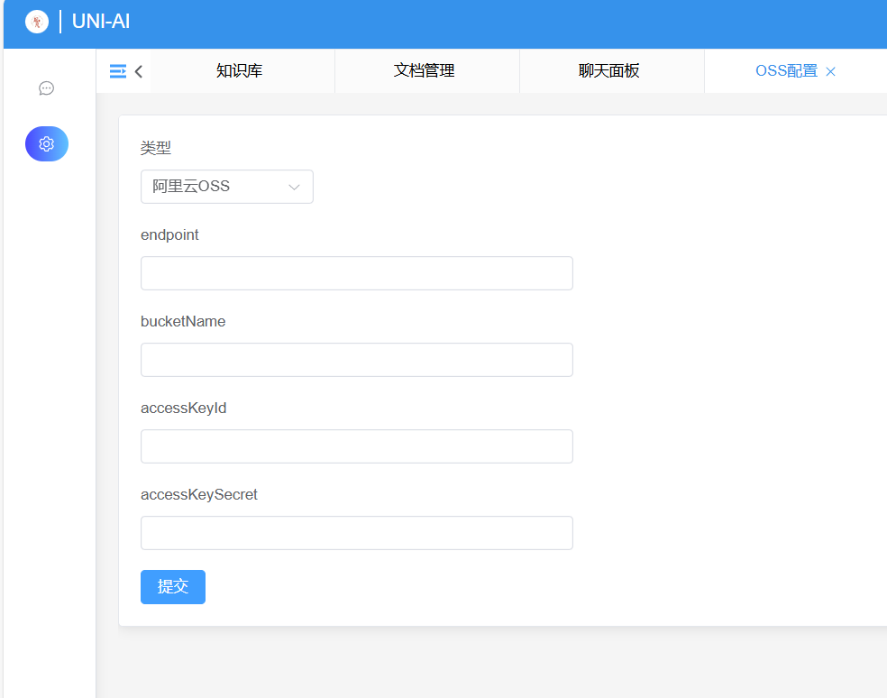
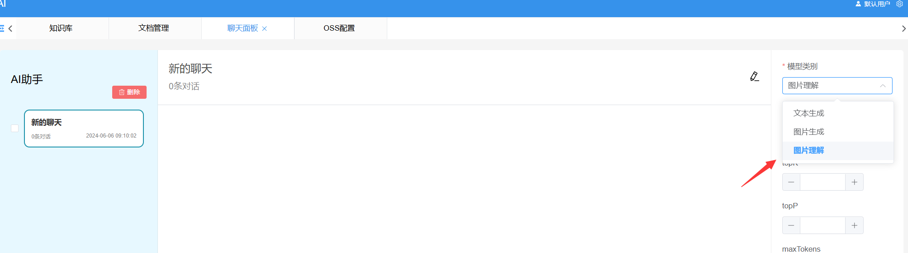

---
dir:
    link: true
    order: 3
    collapsible: false
---

# 使用教程

## AI厂商密钥配置

[kimi api-key申请](https://platform.moonshot.cn/console/api-keys)
[智谱清言 api-key申请](https://maas.aminer.cn/usercenter/apikeys)
[百度千帆 access-key和secret-key](https://console.bce.baidu.com/iam/#/iam/accesslist)
[阿里灵积 api-key](https://dashscope.console.aliyun.com/apiKey)
[讯飞星火 api-key、api-secret、appid](https://console.xfyun.cn/app/myapp)

:::warning
有些ai厂商的api-key需要实名认证后才能使用，请务必确保先实名认证
:::

将申请完的api-key填入对应ai厂商的配置页面即可。

## 知识库

### 新建知识库

菜单路径：Ai助手/知识库

:::warning
知识库的英文名称只能包含字母和_
:::

:::info
目前有四种嵌入模型embedding-2，bge-large-en，text-embedding-v2，text-embedding-3-small分别来自智谱清言、百度千帆、阿里灵积、OpenAi
:::

### 上传文档

菜单路径：Ai助手/文档管理

### 知识库问答

菜单路径：Ai助手/聊天面板

在面板中开启知识库，选择知识库发送消息即可。

## 图片理解

### OSS配置

菜单路径：Ai配置/OSS配置

要使用图片理解要发送图片，图片必须公网可以访问。因此在创建OSS的时候要设置bucket的策略为共有读

目前可以支持阿里云OSS和腾讯云OSS.

::: warning
创建bucket记得设置共有读。允许所有域名访问。
:::

### 发送图片

菜单路径：Ai助手/聊天面板/模型类别

在模型类别中选择图片理解，并且在下面的模型中选择需要的模型。最好选择国内的模型。
接着在输入框那边选择图片发送即可。

## 图片生成

菜单路径：Ai助手/聊天面板/模型类别

在模型类别中选择图片生成，并且在下面的模型中选择需要的模型。最好选择国内的模型。
接着在输入框发送提示词即刻生成图片。

:::info
目前图片生成的api不支持上下文。因此描述的时候描述的详细一些。
:::
